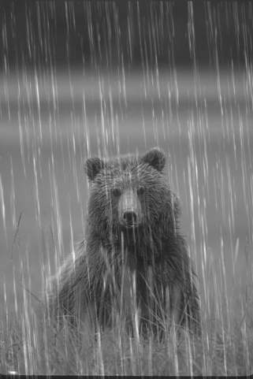
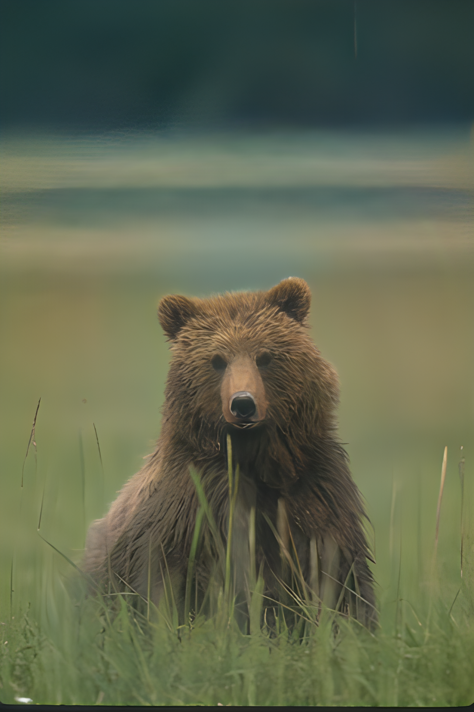

<div align="right">
  <a href="README_EN.md">English</a> | <strong>中文</strong>
</div>

<div align="center">


<div>
  
</div>

# Enhance Agent: 通过自然语言实现图像质量增强
</div>


## 📖 项目介绍

**Enhance Agent** 是一个智能图像处理系统，通过自然语言指令实现图像编辑操作。系统采用多智能体协作架构，能够理解用户的自然语言指令，完成任务拆解，并调用对应工具，自动执行相应的图像处理任务。

### 特点
- 支持自然语言指令
- 支持复合指令
- 支持多轮增强

### 效果示例

| 输入图像 | Prompt | 输出图像 |
| --- | --- | --- |
|  | 先去雨再上色再超分 |  |
|  | 先消除噪点，再超分 |  |

### UI界面

<div align="center">
  
</div>

## 🚀 快速开始

### 环境构建
```bash
conda create -n enhanceAgent python=3.10
conda activate enhanceAgent
pip install torch==2.5.0 torchvision==0.20.0 torchaudio==2.5.0 --index-url https://download.pytorch.org/whl/cu121
cd KAIR
pip install -r requirement.txt
pip install basicsr natsort gdown fastmcp Pillow gradio
```

### 模型下载

```bash
sh download_model.sh
```

### 设置LLM秘钥
使用的是火山引擎的doubao-seed-1-6-lite-251015模型作为意图分析和调度模型，在使用前请在config.py中配置自己的DOUBAO_API_KEY（有50w token的免费额度）

```python
DOUBAO_API_KEY = "****"
```


### 运行

#### 1. Gradio UI模式
```bash
python chat_ui.py
```


#### 2. CLI模式
```bash
python cli_main.py --image ./testset/grayscale.png --instruction "上色后超分" --output ./output/test_out.png
```


### 支持的指令示例

- ✅ "将图片转换为灰度图"
- ✅ "先灰度化再旋转90度"
- ✅ "为这张上色"
- ✅ "提高图像分辨率"
- ✅ "去除图像噪点"
- ✅ "去雨再超分"
- ✅ "去掉雨点"
- ✅ "变清晰"
- ✅ "先去噪再去模糊再超分再上色"

  等各种组合
  
  更多能力将持续接入
---


